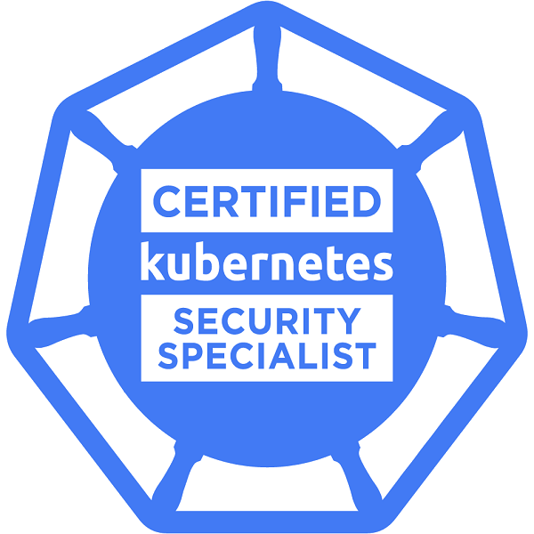
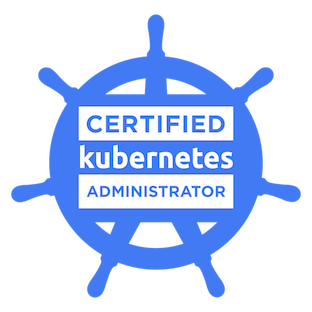
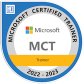
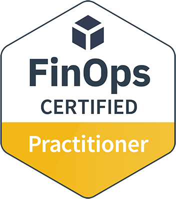
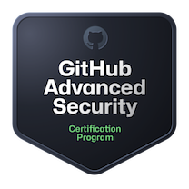
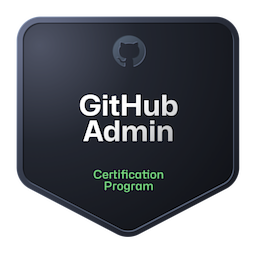
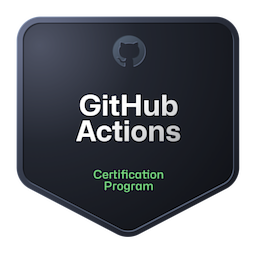

 ---
  # 👋 Hi, I'm Omar McIver

  - 🏗️ **Principal Cloud & AI Platform Architect** at [Mode3 Cloud](https://www.mode3.cloud)
  - 🤖 Building production AI platforms, RAG pipelines, and LLM orchestration solutions
  - ☁️ **Microsoft Certified Trainer**, **Azure Solutions Architect Expert**, **CKA/CKS**
  - 📖 Author of [this awesome book](https://www.amazon.com/stores/author/B0BW5C8SZP/allbooks). Stay tuned for the next one!
  - 💻 Madly in love with .NET C#, Python, and TypeScript
  - 🛠️ Willing to dabble in any language or script

  ---

  ## 📫 Connect with Me

  - [Personal Blog](https://www.omarmciver.com/)
  - [YouTube](https://www.youtube.com/c/OmarMcIver)
  - [LinkedIn](https://www.linkedin.com/in/omarmciver/)
  - [GitHub](https://github.com/omarmciver) 👈 YOU ARE HERE!
  - ☕ [Would you like to buy me a coffee?](https://www.buymeacoffee.com/omarmciver)

  ---

  ## 🚀 What I'm Working On

  - Enterprise AI platform architecture with LangChain, Semantic Kernel, and MCP protocols
  - RAG pipelines with vector databases (Pinecone, Chroma, pgvector)
  - Kubernetes-based ML/AI serving infrastructure
  - Cloud cost optimization and FinOps practices

  ---

<!-- Certifications -->
## 📚 Certifications

          

---

  ## 🛠️ Tech Stack

  ### 💻 Programming & Frameworks
  - `C#` `.NET Core` `Python` `TypeScript` `JavaScript` `ReactJS` `Next.js` `FastAPI`

  ### 🤖 AI/ML & Data
  - `LangChain` `Semantic Kernel` `OpenAI` `Claude` `Pinecone` `Chroma` `pgvector`
  - `Databricks` `Azure Synapse` `Apache Spark` `Delta Lake`

  ### 🐳 Containers & Orchestration
  - `Docker` `Kubernetes` `Helm` `AKS` `EKS`

  ### 🏗️ Architecture & Data
  - `Microservices` `Event-Driven Architecture` `Domain Driven Design`
  - `PostgreSQL` `MongoDB` `Redis` `CosmosDB` `Kafka`

  ### 🚀 DevOps & Cloud
  - `Terraform` `GitHub Actions` `Azure DevOps` `Prometheus` `Grafana`
  - `Azure` `AWS` `GCP`

  ---

  **Disclaimer**: All views are my own and do not represent those of my employer.
